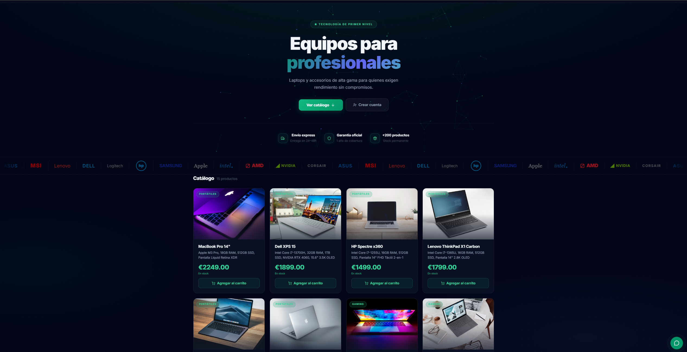
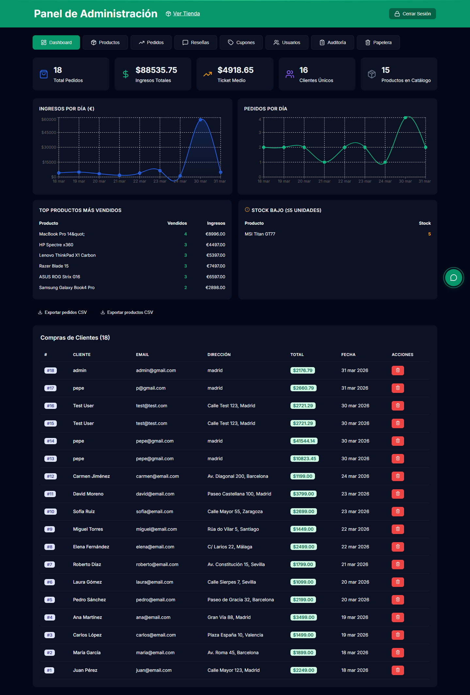
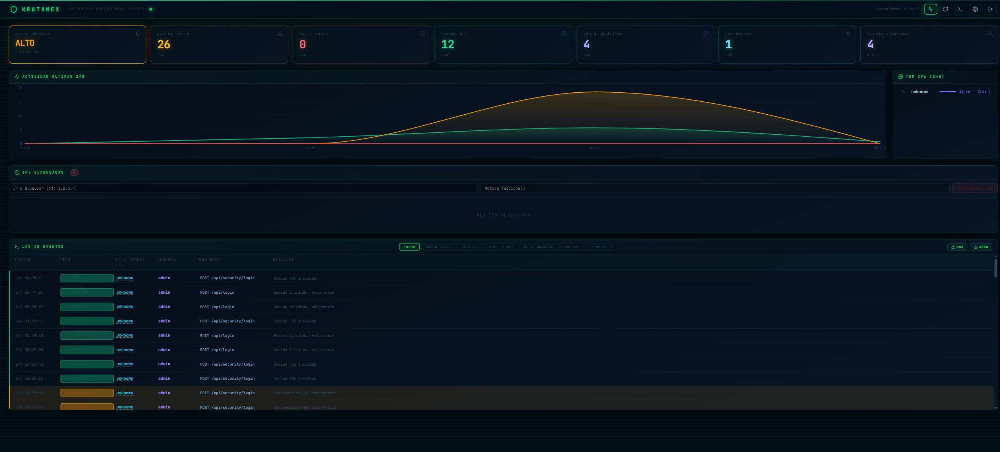

# Kratamex


[](https://sonarcloud.io/project/overview?id=ddelbarriojuan-code_kratamex-ecommerce)
[](https://sonarcloud.io/project/overview?id=ddelbarriojuan-code_kratamex-ecommerce)
[](https://sonarcloud.io/project/overview?id=ddelbarriojuan-code_kratamex-ecommerce)

Kratamex es un e-commerce full-stack con tres superficies separadas:

- tienda principal para clientes
- panel de administracion
- panel SOC para monitorizacion y respuesta basica ante eventos de seguridad

La implementacion actual usa React 19 en frontend, Hono + Drizzle en backend y PostgreSQL 16 como persistencia. El repositorio incluye ademas el entorno local con Docker Compose, nginx y documentacion operativa.

## Que incluye

- catalogo de productos con filtros, busqueda, favoritos y carrito persistente
- checkout con Stripe mediante `PaymentIntent` y webhook
- autenticacion con tokens de sesion opacos persistidos en PostgreSQL
- panel admin con CRUD, analitica, exportaciones y auditoria
- panel SOC con login independiente, metricas, eventos, bloqueo de IPs y exportacion
- tests de frontend y backend con Vitest

## Arquitectura actual

### Frontend

- React 19
- TypeScript
- Vite 8
- TanStack Query
- React Router
- Framer Motion
- Recharts

### Backend

- Hono
- Drizzle ORM
- PostgreSQL 16
- argon2id
- Zod
- Stripe Node SDK

### Infraestructura local

- Docker Compose
- nginx
- GitHub Actions
- SonarCloud
- Gitleaks
- autofix automatizado para issues de SonarCloud

## Autenticacion

La aplicacion principal usa tokens opacos de 256 bits, no JWT. Las sesiones de aplicacion y los contadores de rate limiting persisten en PostgreSQL.

El panel SOC tiene login propio y token propio. No comparte sesion con:

- `/api/login`
- `/admin`
- cuentas de cliente

## Accesos principales

| Ruta | Descripcion | Acceso |
|---|---|---|
| `/` | catalogo principal | publico |
| `/producto/:id` | detalle de producto | publico |
| `/login` | acceso principal | publico |
| `/registro` | registro | publico |
| `/perfil` | perfil | usuario autenticado |
| `/mis-pedidos` | historial | usuario autenticado |
| `/admin` | panel admin | admin |
| `/panel` | panel SOC | soc admin |

## Estado del repositorio

La raiz actua como workspace de coordinacion. Las aplicaciones reales viven en:

- `frontend/`
- `backend/`

Este repositorio no debe versionar bases de datos locales ni residuos SQLite.

## Puesta en marcha

### Scripts desde la raiz

```bash
npm run dev:backend
npm run dev:frontend
npm run build
npm run test
npm run docker:up
```

### Docker Compose

Importante: `docker-compose.yml`, `.env.example` y `backend/.env.example` estan preparados solo para desarrollo local.

```bash
cp .env.example .env
cp backend/.env.example backend/.env
docker compose up --build -d
```

Servicios esperados:

| Servicio | URL |
|---|---|
| frontend directo | http://localhost:3000 |
| backend directo | http://localhost:3001 |
| PostgreSQL | localhost:5432 |
| nginx HTTPS | https://localhost |

Nota: `https://localhost` requiere `nginx/certs/cert.pem` y `nginx/certs/key.pem`. Si no existen, el proyecto sigue siendo usable por `http://localhost:3000`.

### Ejecucion manual

```bash
# Backend
cd backend && npm install && npm run dev

# Frontend
cd frontend && npm install && npm run dev
```

## Credenciales locales de desarrollo

En la configuracion local actual del repositorio:

| Dominio | Usuario | Contrasena |
|---|---|---|
| tienda admin | `admin` | `admin` |
| cliente demo | `user` | `user` |
| SOC | `admin` | `admin` |

Estas credenciales son solo para desarrollo local.

## Variables de entorno

Los archivos `.env.example` y `backend/.env.example` son plantillas de desarrollo local. No son una configuracion endurecida de produccion.

## Endpoints destacados

### Aplicacion principal

| Metodo | Ruta | Descripcion |
|---|---|---|
| GET | `/api/productos` | lista de productos |
| GET | `/api/productos/:id` | detalle |
| GET | `/api/categorias` | categorias |
| POST | `/api/login` | login |
| POST | `/api/register` | registro |
| POST | `/api/logout` | logout |
| GET | `/api/usuario` | usuario autenticado |
| PUT | `/api/usuario/perfil` | actualizar perfil |
| PUT | `/api/usuario/password` | cambiar contrasena |
| GET | `/api/mis-pedidos` | pedidos del usuario |
| GET | `/api/favoritos` | favoritos |

### Administracion

| Metodo | Ruta | Descripcion |
|---|---|---|
| GET | `/api/admin/pedidos` | pedidos |
| GET | `/api/admin/usuarios` | usuarios |
| GET | `/api/admin/analytics` | metricas |
| GET | `/api/admin/audit-log` | auditoria |
| GET | `/api/admin/cupones` | cupones |

### SOC

Rutas preferentes actuales:

| Metodo | Ruta | Descripcion |
|---|---|---|
| POST | `/api/panel/login` | login SOC |
| POST | `/api/panel/logout` | logout SOC |
| GET | `/api/panel/stats` | metricas |
| GET | `/api/panel/events` | eventos |
| GET | `/api/panel/blocked-ips` | IPs bloqueadas |
| POST | `/api/panel/blocked-ips` | bloquear IP |
| DELETE | `/api/panel/blocked-ips/:ip` | desbloquear IP |

Compatibilidad:

- el backend mantiene aliases en `/api/security/*`
- el frontend del panel consume `/api/panel/*`

## Validacion actual

Estado validado localmente tras la ultima auditoria:

- backend build: OK
- frontend build: OK
- backend tests: 103 OK
- frontend tests: 296 OK
- smoke tests de tienda, admin, SOC, favoritos, valoraciones, 2FA y auditoria: OK

## Autofix SonarCloud

El repositorio tiene dos workflows de autofix que comparten el script `.github/scripts/groq-autofix.mjs`:

- `.github/workflows/sonarcloud-autofix.yml`: trigger manual o `repository_dispatch` para un issue concreto
- `.github/workflows/groq-autofix.yml`: barrido programado cada 4 horas sobre issues abiertos

El flujo intenta corregir archivos en `frontend/src` y `backend/src`, valida con TypeScript por archivo y solo commitea si despues pasan `npm run build` y `npm run test`.

Detalle operativo: `docs/AUTOFIX_AUTOMATION.md`

## Estructura del proyecto

```text
proyecto/
|-- frontend/
|-- backend/
|-- nginx/
|-- docs/
|-- scripts/
|-- docker-compose.yml
|-- package.json
|-- correcciones_seguridad.md
|-- README.md
```

## Capturas

### Catalogo principal



### Panel de administracion



### Panel SOC


